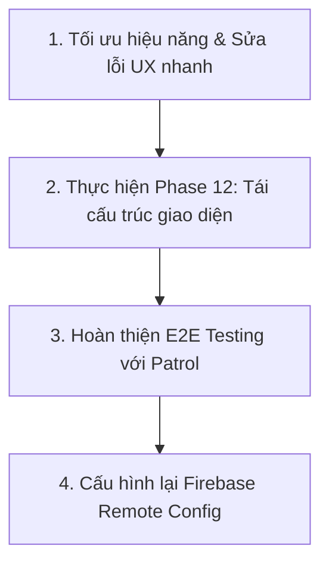

# Đánh giá & Phản hồi Tài liệu Review (feedback.md)

Tài liệu này đánh giá tính chính xác của tệp `feedback.md` (đạt điểm đánh giá **5.5/10**) đối với tình trạng thực tế của dự án **Journal Trend Analysis** (PRM393 - Lab 03). Bản đánh giá này giúp nhóm phát triển tối ưu hóa ứng dụng để đạt điểm số cao nhất từ Hội đồng Chuyên gia (Experts/Teachers).

---

## 1. Đánh giá Tổng quan (Executive Assessment)

> [!IMPORTANT]
> **Kết luận**: Điểm số **5.5/10** trong `feedback.md` mang tính chất **khắt khe theo tiêu chuẩn sản phẩm thương mại thương mại (commercial product)**, nhưng lại **bỏ qua ngữ cảnh học thuật và yêu cầu bắt buộc của môn học PRM393 (Lab 03)**.
> Tuy nhiên, tài liệu review cũng chỉ ra một số điểm yếu chí mạng về hiệu năng của máy ảo/thiết bị di động thật và thiết kế giao diện UX bị chồng chéo mà nhóm cần đặc biệt lưu ý trước khi thuyết trình.

| Nội dung phản hồi | Đánh giá tính chính xác | Giải thích & Đối chứng với Code thực tế |
| :--- | :---: | :--- |
| **Thiếu xử lý Error/Loading/Empty states** | **SAI THỰC TẾ** | Mã nguồn hiện tại trong `home_screen.dart`, `journal_screen.dart`, `keywords_screen.dart` đều đã triển khai đầy đủ các trạng thái `CircularProgressIndicator()`, `DashboardFailure`, `PublicationsState.errorMessage` kèm nút **Retry** (Tải lại) và hiển thị *"No publications found"* khi danh sách trống. |
| **Không đề cập chiến lược kiểm thử** | **SAI THỰC TẾ** | Dự án đã có cấu trúc thư mục `test/` (unit & widget tests) và tài liệu `tasks_cr_01.md` đã hoạch định rõ ràng việc cài đặt E2E testing bằng **Patrol framework** ở Phase 13 (Test Case 1 đến 11). |
| **Firebase Auth & Cloud là dư thừa/gây phiền** | **SAI NGỮ CẢNH** | Việc tích hợp Firebase (Auth, Storage, Messaging, Remote Config, Crashlytics) là **yêu cầu bắt buộc chiếm 25% tổng số điểm** của môn học PRM393 Lab 03. Việc loại bỏ đăng nhập sẽ làm mất điểm phần này. |
| **Hiệu năng GraphView trên di động rất kém** | **ĐÚNG HOÀN TOÀN** | Việc dựng đồ thị đồng tác giả (`GraphView` dùng `FruchtermanReingoldAlgorithm`) vẽ trực tiếp trên UI thread di động sẽ gây giật lag (jank/freeze) nếu danh sách bài viết quá lớn. |
| **Giao diện Keywords bị quá tải (overload)** | **ĐÚNG (Đang phát triển)** | Màn hình `keywords_screen.dart` hiện tại tích hợp quá nhiều tab biểu đồ và đồ thị mạng lưới. Điều này là do dự án đang ở giữa giai đoạn phát triển và chưa thực hiện xong **Phase 12 (Tái cấu trúc màn hình & Tách trang Chi tiết Từ khóa)**. |

---

## 2. Phân tích chi tiết & Đối chứng Mã nguồn

### 2.1. Các phản hồi CHƯA CHÍNH XÁC (Thiếu ngữ cảnh & Sai thực tế code)

#### 🛡 Trạng thái Loading, Lỗi (Error) và Trống (Empty States)
* **Lời phê trong feedback.md**: *"Zero mention of empty states, error states, or loading states anywhere in the document."*
* **Thực tế mã nguồn**: Lớp giao diện đã xử lý các trạng thái này rất triệt để bằng BLoC:
  * **Tại [home_screen.dart](file:///d:/FPT/Semester_8/PRM393/Lab23_JournalTrendAnalysis/lib/features/home/presentation/screens/home_screen.dart#L92-L101)**:
    ```dart
    if (state is DashboardLoading || state is DashboardInitial) {
      return const Center(child: CircularProgressIndicator());
    }
    ```
  * **Tại [journal_screen.dart](file:///d:/FPT/Semester_8/PRM393/Lab23_JournalTrendAnalysis/lib/features/journal/presentation/screens/journal_screen.dart#L99-L135)**:
    Đã xử lý đầy đủ ba trạng thái: Loading ban đầu, hiển thị lỗi kèm nút **Retry**, và hiển thị thông báo *"No publications found"* khi danh sách trống.

#### 🛡 Firebase Services & Tính năng Login
* **Lời phê trong feedback.md**: Chỉ trích việc ép buộc người dùng đăng nhập Google Sign-In và cài đặt Firebase là không cần thiết, tăng độ ma sát (friction).
* **Thực tế môn học**: Theo [requirements_change_request_01.md](file:///d:/FPT/Semester_8/PRM393/Lab23_JournalTrendAnalysis/docs/requirements/requirements_change_request_01.md#L231-L243), việc cài đặt Firebase Auth, Storage, FCM, Crashlytics, Remote Config là bắt buộc. Do đó, việc thiết kế Login là bắt buộc để chấm điểm.

#### 🛡 Chiến lược Kiểm thử (Testing)
* **Lời phê trong feedback.md**: *"No testing strategy documented."*
* **Thực tế dự án**: Kế hoạch kiểm thử tự động toàn diện sử dụng **Patrol CLI** đã được thiết lập chi tiết tại [tasks_cr_01.md](file:///d:/FPT/Semester_8/PRM393/Lab23_JournalTrendAnalysis/docs/tasks/tasks_cr_01.md#L82-L100) (gồm 11 Test Cases chính bao quát từ Login, Search, Navigation đến PDF Export và Remote Config).

---

### 2.2. Các phản hồi ĐÚNG (Cần khắc phục để cải thiện UI/UX và chấm điểm Expert)

> [!WARNING]
> Những điểm dưới đây là các lỗi kỹ thuật và trải nghiệm người dùng thực tế mà các chuyên gia chấm thi (Experts) sẽ dễ dàng phát hiện khi chạy app trên điện thoại.

#### 🔴 Rủi ro hiệu năng của Bản đồ mạng lưới tác giả (`GraphView`)
* **Vấn đề**: `GraphView` dựng cấu trúc liên kết đồng tác giả trực tiếp trên luồng giao diện chính (UI Thread). Với các chủ đề nghiên cứu lớn có nhiều tác giả đồng hành, thuật toán kéo đẩy vật lý `FruchtermanReingoldAlgorithm` sẽ tính toán liên tục, gây tụt khung hình (FPS drop) nghiêm trọng hoặc đơ máy ảo.
* **Giải pháp khắc phục**: 
  1. Giới hạn số lượng tác giả hiển thị trên mạng lưới (ví dụ: chỉ lấy tối đa 15-20 tác giả hàng đầu).
  2. Bổ sung cơ chế bật/tắt (Toggle) hiển thị mạng lưới hoặc chỉ vẽ đồ thị khi người dùng yêu cầu, tránh tự động vẽ ngay khi nhấn vào tab.

#### 🔴 Giao diện màn hình Keywords bị quá tải thông tin (Tab Overload)
* **Vấn đề**: Hiện tại `keywords_screen.dart` đang chứa cả biểu đồ tiến trình từ khóa, danh sách từ khóa mới nổi, biểu đồ phân tán tác giả, và đồ thị mạng lưới hợp tác. Điều này khiến màn hình quá dài, nhiều cử chỉ vuốt bị xung đột (ví dụ: vuốt chuyển tab xung đột với kéo thả đồ thị mạng lưới).
* **Giải pháp khắc phục (Đang thực hiện ở Phase 12)**:
  1. Tái cấu trúc lại `keywords_screen.dart`: Chỉ hiển thị danh sách từ khóa và thanh tìm kiếm từ khóa đơn giản.
  2. Tạo mới màn hình độc lập [KeywordDetailScreen](file:///d:/FPT/Semester_8/PRM393/Lab23_JournalTrendAnalysis/docs/tasks/tasks_cr_01.md#L74-L79). Khi người dùng bấm vào một từ khóa, hệ thống sẽ điều hướng sang trang chi tiết này để xem biểu đồ và số liệu phân tích của riêng từ khóa đó. Việc này sẽ giải phóng không gian hiển thị và giảm xung đột cử chỉ.

#### 🔴 Thời gian Timeout của API quá dài (Dio 40 giây)
* **Vấn đề**: Trong cấu hình `ApiClient`, thời gian kết nối và phản hồi được cài đặt là 40 giây. Nếu mạng yếu hoặc API OpenAlex bị chậm, ứng dụng sẽ bị treo trạng thái loading tới 40 giây trước khi thông báo lỗi cho người dùng. Điều này tạo trải nghiệm rất tệ.
* **Giải pháp khắc phục**: Hạ thời gian `connectTimeout` và `receiveTimeout` xuống khoảng **8 - 10 giây**. Nếu quá thời hạn này, hiển thị nút **Thử lại (Retry)** ngay lập tức.

#### 🔴 Sự mơ hồ của Citation Star Rating
* **Vấn đề**: Việc sử dụng icon Ngôi sao (`Icons.star`) đi kèm với số lượt trích dẫn (ví dụ: `⭐ 12,345`) dễ làm người dùng nhầm lẫn đây là điểm đánh giá xếp hạng chủ quan (Rating từ 1-5 sao) thay vì chỉ số trích dẫn khách quan (Citation Count).
* **Giải pháp khắc phục**: Thay thế icon `Icons.star` bằng các icon mang tính học thuật hoặc trích dẫn chính xác hơn như `Icons.format_quote` hoặc `Icons.analytics_outlined`.

---

## 3. Đề xuất Kế hoạch Hành động (Action Plan) để đạt điểm tối đa

Để chuẩn bị tốt nhất cho buổi đánh giá của chuyên gia, nhóm nên tập trung hoàn thiện các nhiệm vụ theo thứ tự ưu tiên sau:



1. **Ưu tiên 1: Sửa đổi nhanh cấu hình & Giao diện**
   - Giảm `connectTimeout` của `Dio` xuống còn `8000` (8 giây) tại [api_client.dart](file:///d:/FPT/Semester_8/PRM393/Lab23_JournalTrendAnalysis/lib/core/network/api_client.dart#L12-L13).
   - Thay thế icon ngôi sao trích dẫn bằng icon trích dẫn học thuật (`Icons.format_quote`) trên toàn bộ các thẻ bài báo.
   - Thêm nút "Skip" (Bỏ qua thiết lập) tại màn hình `setup_screen.dart` để tránh khóa chết người dùng nếu họ không muốn chọn chủ đề lập tức.

2. **Ưu tiên 2: Triển khai hoàn thiện Phase 12**
   - Mở rộng grid trang chủ lên đủ 6 chỉ số bắt buộc của Lab 3.
   - Viết mới màn hình `KeywordDetailScreen` độc lập để giảm tải cho tab Keywords.
   - Chuyển màn hình Journals từ danh sách bài viết sang danh sách xếp hạng tạp chí đóng góp.

3. **Ưu tiên 3: Hoàn thiện E2E Tests bằng Patrol**
   - Chạy thành công toàn bộ 11 Test Cases trên thiết bị Android ảo/thật để chụp ảnh minh chứng cho báo cáo. Chuyên gia rất đánh giá cao phần E2E test tự động này vì nó thể hiện độ tin cậy của phần mềm.
